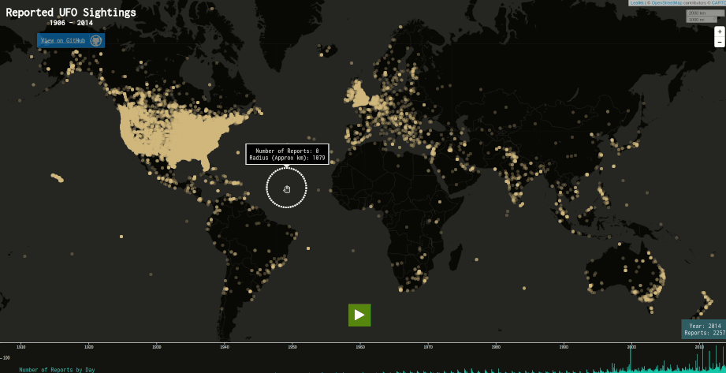

# A4-UFO-Sightings
Explore over 80K reports of UFO sightings around the world, collected from 1906 - 2014! The underlying dataset was scraped, geolocated, and time standardized from the National UFO Reporting Center (NUFORC) database, and hosted [here](https://github.com/planetsig/ufo-reports) by Sigmond Axel. I performed further cleaning and web scraping from the [NUFORC database](http://www.nuforc.org/webreports.html) to enhance the final dataset; see [Dataset](#dataset) section, and [process_data.py](resources/data/process_data.py) and [process_data_part2.py](resources/data/process_data_part2.py) for details.

The interactive map is [here](https://github.mit.edu/pages/6894-sp20/A4-UFO-Sightings/). I've only tested it on Desktop Chrome with mouse interaction.

## Resources
Any code and resources borrowed are cited throughout the codebase in comments. In addition to third-party tools and data used, they're explicitly outlined below:

### Dataset
* [Geocoded NUFORC Data 1906 - 2014](resources/data/ufo_sightings_original.csv): This is the basis for the final data used in this visualization. This dataset was scraped, geolocated, and time standardized from NUFORC data, and hosted [here](https://github.com/planetsig/ufo-reports) by Sigmond Axel. However, this dataset does not contain the full text of the sighting reports.

* [nuforc_events.csv](https://github.com/khturner/nuforc_data/blob/master/): This is the result of another attempt at NUFORC database scraping by Keith Turner. The data is available [here](https://data.world/khturner/national-ufo-reporting-center-reports), and the code he used to generate the data is [here](https://github.com/khturner/nuforc_data/blob/master/). This dataset not only does not contain the full text of the sighting reports, but also does not contain geo location data. However, unlike the dataset above, this one contains the web links to the reference NUFORC database for each report, which contains the full report texts.

* [nuforc_reports.csv](https://data.world/timothyrenner/ufo-sightings): This data is the result of yet another attempt at NUFORC database scraping by Timothy Renner. The data is available [here](https://data.world/timothyrenner/ufo-sightings), and the code he used to generate the data is [here](https://github.com/timothyrenner/nuforc_sightings_data). This dataset contains almost all the fields desired (full report text, original report links, and geo location data), but the data is much more limited than the first dataset, and consists of reports mostly just from the United States and Canada.

In short, I want a dataset consisting of all the information from the first dataset, plus the full text of the sighting reports. To this end, I wrote and executed [process_data.py](resources/data/process_data.py) and [process_data_part2.py](resources/data/process_data_part2.py) to combine the three datasets, and web scraped the [NUFORC database](http://www.nuforc.org/webreports.html) for the remaining unresolved reports for full text.

The final cleaned and processed dataset used is [ufo_sightings_final.csv](resources/data/ufo_sightings_final.csv).

### Third Party Tools
* [D3 (version 5)](https://github.com/d3/d3): For the data loading, quadtree implementation for efficient nearest neighbor search (for identifying reports on the map within a certain radius from the mouse position), and everything SVG related (i.e. the timeline chart component rendering).
* [Leaflet (version 1.6.0)](https://leafletjs.com/): For the map markers rendering, and map interactions such as panning and zooming.
* [Leaflet Providers](https://github.com/leaflet-extras/leaflet-providers) via [CartoDB](https://carto.com/attribution/): For the dark themed map tiles.
* [Leaflet Extra Markers](https://github.com/coryasilva/Leaflet.ExtraMarkers): For rendering custom markers showing the corresponding UFO shape as reported in the selected report.

### Miscellaneous Resources
* [Inconsolata Font](https://fonts.google.com/specimen/Inconsolata): For the monospace font used throughout the visualization.
* [Alien Favicon](https://favicon.io/emoji-favicons/alien-monster/): For the page's favicon (browser tab icon).
* [Icons8 Icons](https://icons8.com/icons): For showing the UFO shape on map markers upon selection. The specific attributions are displayed on the bottom of the visualization reports panel upon selection of map markers.
* [Loading Indicator](https://loading.io/css/): For the HTML and CSS ripple animation for the indicator in the loading screen.
* [Stars Background Images](https://dellsystem.me/posts/night-sky-css): For the background star images in the loading screen.
* [Thematic Break CSS](https://css-tricks.com/examples/hrs/): The CSS was not used directly verbatim, but served as a starting point for the thematic break shown in the reports panel of the visualization.
* [StackOverflow Solution](https://stackoverflow.com/a/52112155): This solution from a StackOverflow user is used to determine the locale of the user's browser, used for date formatting.
